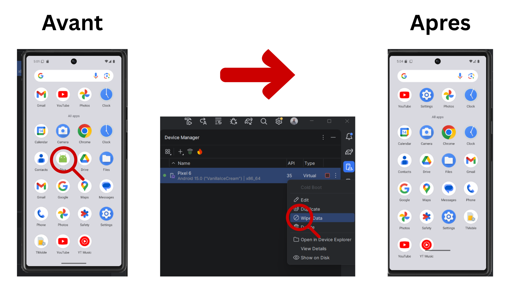

# Lab_2_MobileSecurity

> Objectif général : préparer un environnement Android de test (**AVD**), vérifier **ADB**, obtenir le **root** sur l’émulateur, puis travailler sur un **AVD propre** pour éviter des résultats faussés.

---

## Partie 1 — Vérification ADB

### But
Vérifier que l’**AVD** est bien détecté avant de commencer le lab.

### Étapes
1. Lancer l’**AVD** (Pixel — émulateur).
2. Ouvrir PowerShell.
3. Vérifier la connexion :

```powershell
adb devices
```

### Résultat attendu
- L’émulateur apparaît en **device** (ex: `emulator-5554   device`).


---

## Partie 2 — Étape 1 : Rooter l’AVD

### Objectif
Obtenir des privilèges **root** sur un **AVD** (environnement jetable) et observer l’état des contrôles d’intégrité (**AVB / vbmeta / verity**).

### Pré-requis
- AVD démarré
- `adb` détecte l’émulateur

### Vérifications principales (preuves)
- `adb root` :ôle : vérifier que **adbd** tourne en mode root.
- `adb shell id` : vérifier `uid=0(root)`.
- `getprop` : observer **verity / vbmeta / avb** (selon l’image Android).

### Journalisation (preuve)
Exporter les 200 dernières lignes de logcat :

### Résultat attendu


```powershell
adb logcat -d -t 200 > logcat_root_check.txt
```

### Où trouver le fichier logcat
Le fichier a été généré ici :

`C:\Users\Ismai\lab_logs\logcat_root_check.txt`

Pour l’ouvrir rapidement :

```powershell
explorer .
notepad .\logcat_root_check.txt
```
### Résultats attendu


## Partie 3 — Étape 3 : Démarrer un AVD propre

### But
Démarrer un **AVD propre** (sans applications résiduelles et sans compte personnel) pour éviter des résultats faussés.

### Actions
- Android Studio → Device Manager → **Start** (ou créer un AVD récent, API 29+).
- Vérifier visuellement : **écran d’accueil Android**, **aucun compte personnel**.

### Vérification
```powershell
adb devices
```

### Résultat attendu


---
## Étape 4 — Installer et lancer l’app de test (DIVA)

### Source de l’APK
L’application de test (**DIVA**) a été récupérée depuis GitHub (dépôt contenant le fichier APK), puis installée sur l’AVD via **ADB**.


### Installation + Lancement
- Installation de l’APK sur l’émulateur avec `adb install`.
- Ouverture de l’application sur l’AVD et vérification qu’un scénario simple est réalisable.

### Version (rapport)
La version de l’application a été relevée (car le comportement de sécurité peut varier selon la version).

### Résultat attendu


---
## Étape 5 — Définir 3 scénarios simples (DIVA)

### Méthodologie
Ces scénarios sont des **parcours utilisateur** de référence. Ils sont **simples** et **répétables** (mêmes actions, mêmes entrées, pas de contenu aléatoire).  
Pour chaque scénario : on note le **module**, les **entrées exactes**, le **bouton cliqué** et le **résultat affiché**.

---

### Scénario 1 — Insecure Logging (action + message)
**Module :** `1. Insecure Logging`  
**Objectif :** lancer une action simple et observer le message affiché.

**Étapes :**
1. Ouvrir `1. Insecure Logging`
2. Laisser la valeur à `0`
3. Cliquer sur **CHECK OUT**
4. Observer le message en bas de l’écran

**Résultat observé :**
- Message : `An error occured. Please try again later`

**Capture :**
- Écran `1. Insecure Logging` avec **CHECK OUT** + message d’erreur.


---

### Scénario 2 — Input Validation Issues (action bouton)
**Module :** `13. Input Validation Issues - Part 3`  
**Objectif :** saisir une entrée et déclencher l’action principale.

**Entrée saisie (texte exact) :**
- Champ texte : `ew`

**Étapes :**
1. Ouvrir `13. Input Validation Issues - Part 3`
2. Saisir `ew`
3. Cliquer sur **PUSH THE RED BUTTON**
4. Observer le message affiché

**Résultat observé :**
- Message : `Access denied!`

**Capture :**
- Écran du module avec la valeur `ew` + bouton rouge + message.
 

---

### Scénario 3 — Insecure Data Storage (sauvegarde)
**Module :** `3. Insecure Data Storage - Part 1`  
**Objectif :** sauvegarder des identifiants de test et vérifier le retour.

**Entrées saisies (texte exact) :**
- Email : `ismai@emsi`
- Mot de passe : (valeur de test, masquée à l’écran)

**Étapes :**
1. Ouvrir `3. Insecure Data Storage - Part 1`
2. Saisir `ismai@emsi` + un mot de passe de test
3. Cliquer sur **SAVE**
4. Observer le message de confirmation

**Résultat observé :**
- Message : `3rd party credentials saved successfully!`

**Capture :**
- Écran du module avec les champs remplis + **SAVE** + message de succès.

---
## Étape 6 : Lire Android Security (6 lignes max)
La sécurité Android fonctionne en plusieurs couches, un peu comme un oignon.  
Le **sandboxing des applications** met chaque app dans son propre espace, pour limiter les interactions avec les autres.  
Le **modèle de permissions** sert de “filtre” : certaines ressources (caméra, contacts, stockage…) ne sont accessibles qu’après accord.  
L’**isolation** et l’**intégrité globale du système** visent à empêcher les retouches non autorisées du système.  
Analogie : chaque app est dans une salle fermée ; pour utiliser du matériel spécial, elle demande au prof ; et le bâtiment entier est protégé contre les modifications de sa structure.

---
## Étape 7 — Verified Boot (idée générale + check AVD)

### Check AVD (résultats observés)
- `adb shell getprop ro.boot.verifiedbootstate` : **vide** (propriété non exposée sur cette image AVD)
- `ro.boot.avb_version = 1.3`
- `ro.boot.veritymode = enforcing`
- `ro.boot.vbmeta.digest` présent (sha256)

### Interprétation (simple)
Même si `verifiedbootstate` n’est pas retourné, la présence de **AVB/vbmeta** et `veritymode=enforcing` indique que les mécanismes d’intégrité au démarrage sont actifs sur cet AVD.

### Résultat attendu


---
## Étape 8 : AVB (Android Verified Boot)
AVB est l’évolution moderne de Verified Boot : il renforce le contrôle d’intégrité au démarrage via des métadonnées signées (vbmeta).  
Il ajoute aussi une défense contre le **rollback**, pour éviter de revenir à une version plus ancienne du système.  
Protection anti-rollback : bloquer l’installation d’anciens builds potentiellement vulnérables, comme empêcher de remplacer une serrure récente par un modèle dépassé plus facile à forcer.

---
## Étape 9 : Définir le rooting (4 phrases)
Le **Root** correspond à l’obtention de privilèges **super-utilisateur** sur Android.  
Il change les barrières de sécurité et affaiblit la confiance accordée au système au démarrage et à l’exécution.  
En labo, c’est pratique pour observer des comportements et tester des contrôles normalement inaccessibles.  
C’est toutefois risqué : il faut un environnement isolé, garder des traces (logs/captures) et prévoir un reset, comme un passe-partout utile en maintenance mais dangereux s’il est mal utilisé ; le mot “root” vient d’UNIX où l’administrateur s’appelle root.

---
## Étape 10 : Intérêt labo (non opérationnel)
En labo, un environnement privilégié peut aider à **observer des artefacts système** normalement invisibles et à **suivre le comportement runtime** d’une application à un niveau plus bas.  
Il sert aussi à **éprouver la solidité du stockage** face à un attaquant privilégié (ex. fichiers, prefs, bases locales).  
Cas concret : avec les privilèges root, on peut vérifier si l’app compte seulement sur la protection du système (mauvaise pratique) ou si elle applique son propre chiffrement (bonne pratique).  
**Labo autorisé uniquement** : sur un appareil personnel/réel, cela peut casser la confiance du système et poser des problèmes de conformité.  
Contexte légal : selon le pays, le rooting peut enfreindre des conditions d’utilisation (voire des règles sur le contournement de protections), donc il faut une autorisation explicite pour tester.

---
## Étape 11 : Matrice de risques (8 risques)

1) **Intégrité non garantie** → conclusions possiblement biaisées ; **atténuation :** signaler l’état (AVB/verity) et comparer avec un AVD “propre”.  
2) **Surface d’attaque accrue hors labo** → exposition à des menaces externes ; **atténuation :** usage strict “labo uniquement” + pas d’usage quotidien.  
3) **Données sensibles exposées** → risque de confidentialité ; **atténuation :** ne jamais utiliser de vraies données + jeux de données fictifs.  
4) **Instabilité système** → tests peu reproductibles ; **atténuation :** documenter versions/étapes + refaire sur snapshot/AVD neuf.  
5) **Mélange comptes perso/test** → fuite d’infos personnelles ; **atténuation :** aucun compte personnel, profils séparés.  
6) **Nettoyage insuffisant en fin de séance** → données qui restent ; **atténuation :** wipe/reset AVD + suppression des fichiers de test.  
7) **Réseau non isolé** → impacts involontaires sur l’extérieur ; **atténuation :** réseau de labo isolé / pas de services réels.  
8) **Traçabilité insuffisante** → difficile d’auditer/rejouer ; **atténuation :** captures + logs + checklist des commandes.

---
## Étape 12 : Mesures défensives (8 mesures)

1) **Réseau isolé** pour éviter toute communication non contrôlée avec l’extérieur.  
2) **Données fictives uniquement** afin d’éliminer le risque de fuite de données réelles.  
3) **Device/AVD dédié** exclusivement aux tests de sécurité, sans usage quotidien.  
4) **Snapshots ou wipe en fin de séance** pour revenir à un état propre et ne rien laisser persister.  
5) **Journal de configuration détaillé** (versions, paramètres, commandes) pour garantir la reproductibilité.  
6) **Aucun compte personnel** pour éviter tout mélange entre données privées et données de test.  
7) **Contrôle strict des APK installées** (source, intégrité, nécessité) pour limiter l’exposition.  
8) **Horodatage + captures** des étapes pour une traçabilité claire et vérifiable.  

*Analogie : comme dans un labo manipulant des substances dangereuses — isolement, matériel dédié, “décontamination” (wipe/snapshots) et documentation rigoureuse.*

---
## Étape 13 : OWASP MASVS (2 exigences)

OWASP est une référence en sécurité, et le **MASVS** est un standard pour évaluer la sécurité des applications mobiles.

- **STORAGE-1 :** Les données sensibles (clés API, mots de passe, tokens) ne doivent pas être stockées “en clair” ; elles doivent être protégées avec un chiffrement adapté et des mécanismes de stockage sûrs.  
- **NETWORK-1 :** Les communications réseau doivent utiliser **TLS** correctement (certificats vérifiés, configuration solide) pour éviter l’écoute ou la modification du trafic.

Application pratique (labo) : avec des privilèges root, on peut inspecter les fichiers locaux de l’app et observer le trafic réseau pour voir si ces exigences sont respectées.

---
## Étape 14 : OWASP MASTG (2 idées de tests)

Le **MASVS** décrit *quoi* vérifier, tandis que le **MASTG** explique *comment* le vérifier (guide pratique de tests).

- **Idée de test 1 (stockage) :** Inspecter les préférences partagées pour repérer des infos sensibles en clair (ex. dans `/data/data/[package_name]/shared_prefs/`) et vérifier si elles sont protégées.  
- **Idée de test 2 (runtime/logs) :** Analyser les logs via `adb logcat` pour détecter des fuites d’informations sensibles pendant l’exécution (identifiants, tokens, données utilisateur).

Astuce : avec les privilèges root (labo), l’accès à `/data/data/` devient possible, alors que ce dossier est normalement isolé par Android.


---
## Étape 15 : Commandes de rooting (rappel synthèse)

### Commandes (AVD / émulateur)
powershell
-adb devices
-adb root
-adb remount
-adb shell id
-adb shell getprop ro.boot.veritymode
-adb shell getprop ro.boot.vbmeta.device_state
-adb shell "su -c id"

---
## Étape 16 : Traçabilité : fiche environnement (1 page)

### Date / Auteur
- Date : 14/02/2026  
- Auteur : Erraouidate IsmaiL

### Support
- Support : AVD (Android Emulator) — environnement de labo uniquement

### Version Android / API
- Android / API : Android 15 (API 35) *(selon AVD)*

### Application testée + version
- App : DIVA (APK depuis GitHub)

### 3 scénarios (répétables)
1) `1. Insecure Logging` → valeur `0` → bouton **CHECK OUT** → message observé.  
2) `13. Input Validation Issues - Part 3` → entrée `ew` → bouton **PUSH THE RED BUTTON** → `Access denied!`  
3) `3. Insecure Data Storage - Part 1` → email `ismai@emsi` + mot de passe test → **SAVE** → `3rd party credentials saved successfully!`

### Observations factuelles (exemples)
- `adb root` : adbd en mode root (uid=0 via `adb shell id`).  
- Verified Boot state : `ro.boot.verifiedbootstate` non retourné (vide sur cette image AVD).  
- `ro.boot.avb_version = 1.3`, `ro.boot.veritymode = enforcing`, `vbmeta.digest` présent.

### Limites
- Propriété `ro.boot.verifiedbootstate` vide sur l’AVD utilisé (pas d’indication “green/yellow/orange/red” affichée).
- Résultats valables pour un **émulateur** (peuvent différer d’un device réel).

### Reset effectué
- Reset/Wipe/Snapshot   
- Preuve : capture (Device Manager : Wipe Data / Snapshot / nouvel AVD propre) ou mention du reset + état AVD propre.


---
## Étape 17 — Remise à zéro AVD (obligatoire fin de séance)

### Méthode utilisée (UI)
Android Studio → **Device Manager** → (AVD) → **Wipe Data**.

### Pourquoi c’est crucial
Ne pas réinitialiser l’environnement laisse des données et traces de tests (risque de contamination des résultats et exposition de données pour la séance suivante).

### Preuve de reset
Après redémarrage, l’AVD revient à un état “neuf” (applications/état initial), visible sur l’écran et confirmé par une capture **Avant / Après**.

### Résultat attendu



