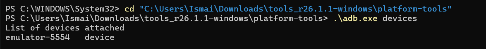
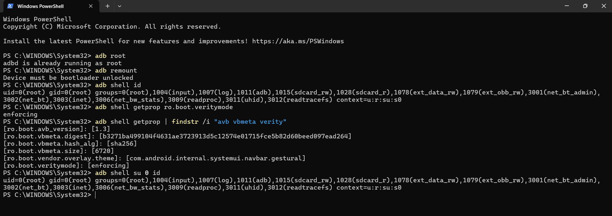
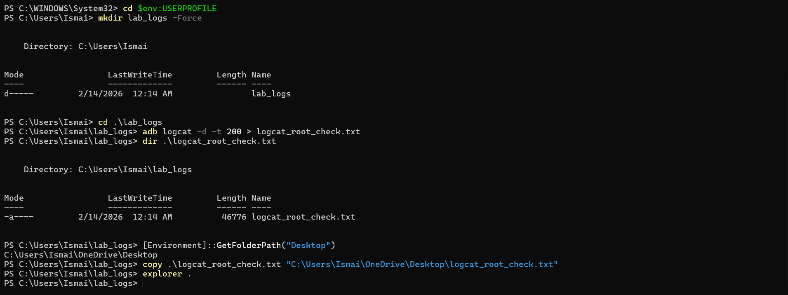
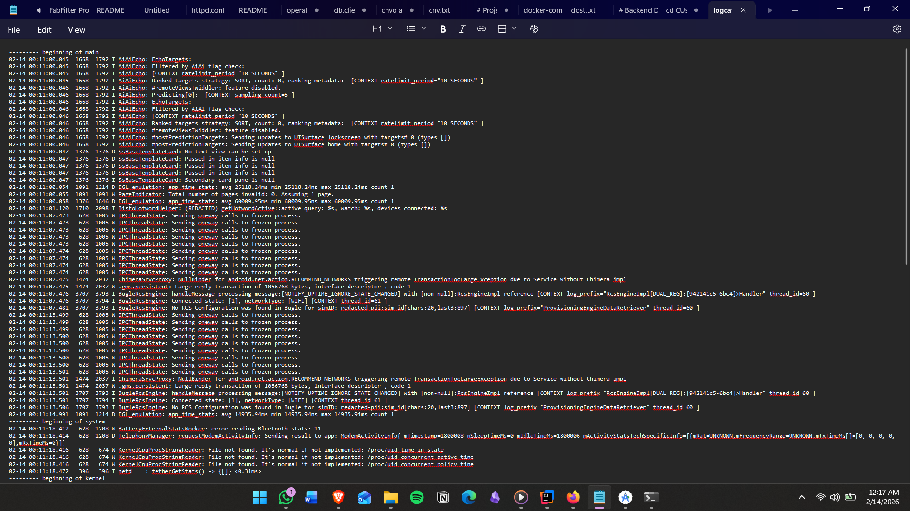
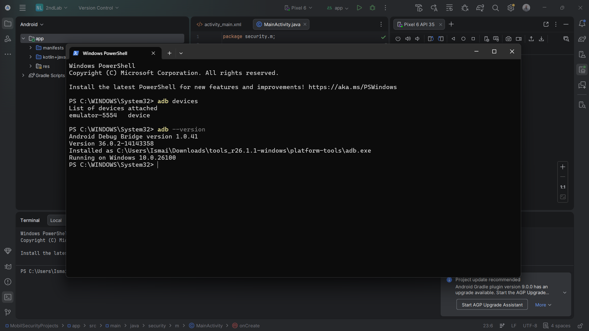
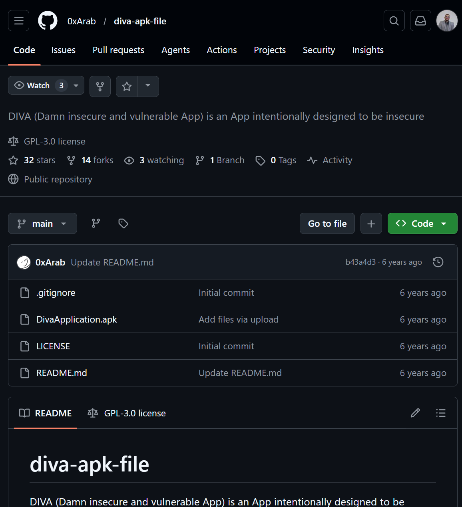
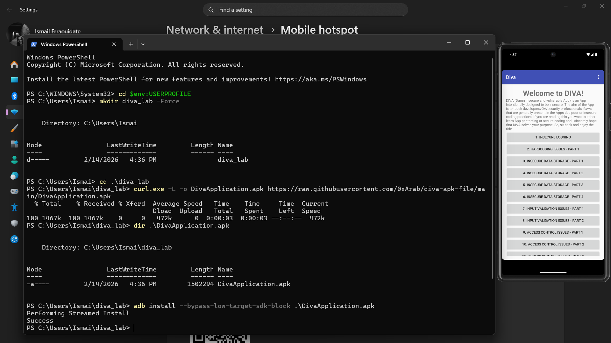
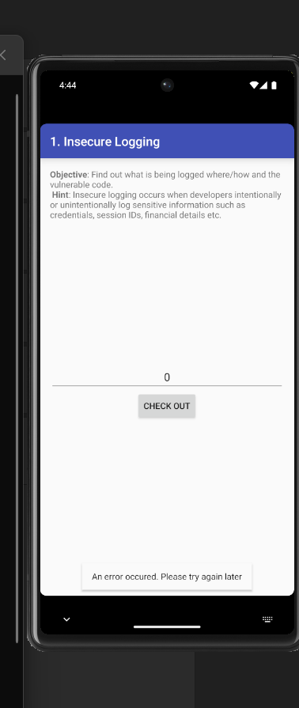
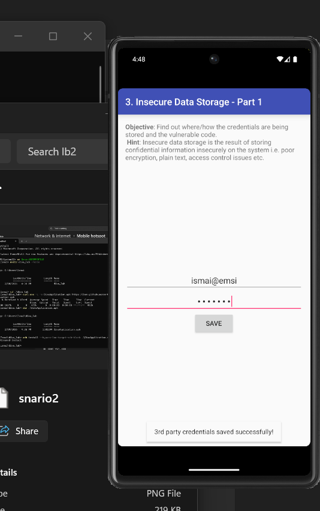
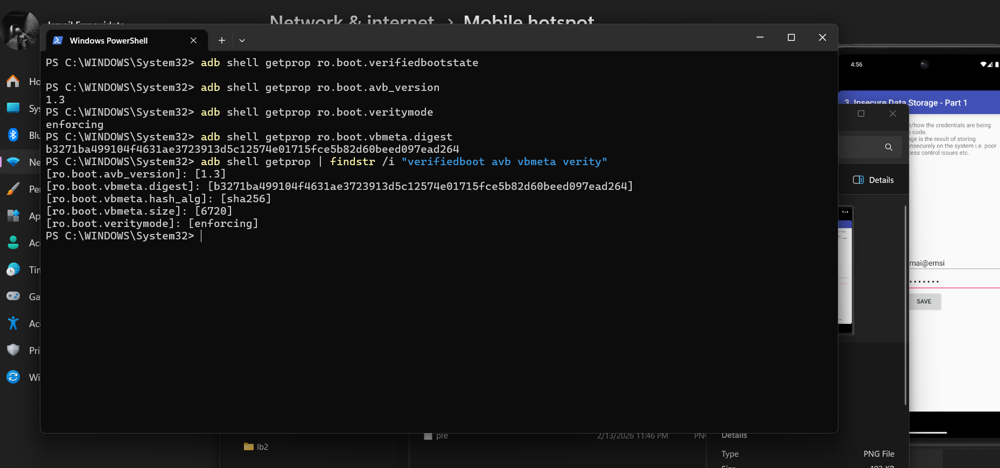

# Lab_2_MobileSecurity

> Objectif général : préparer un environnement Android de test (**AVD**), vérifier **ADB**, obtenir le **root** sur l’émulateur, puis travailler sur un **AVD propre** pour éviter des résultats faussés.

---

## Partie 1 — Vérification ADB

### But
Vérifier que l’**AVD** est bien détecté avant de commencer le lab.

### Étapes
1. Lancer l’**AVD** (Pixel — émulateur).
2. Ouvrir PowerShell.
3. Vérifier la connexion :

```powershell
adb devices
```

### Résultat attendu
- L’émulateur apparaît en **device** (ex: `emulator-5554   device`).



---

## Partie 2 — Étape 1 : Rooter l’AVD

### Objectif
Obtenir des privilèges **root** sur un **AVD** (environnement jetable) et observer l’état des contrôles d’intégrité (**AVB / vbmeta / verity**).

### Pré-requis
- AVD démarré
- `adb` détecte l’émulateur

### Vérifications principales (preuves)
- `adb root` :ôle : vérifier que **adbd** tourne en mode root.
- `adb shell id` : vérifier `uid=0(root)`.
- `getprop` : observer **verity / vbmeta / avb** (selon l’image Android).

### Journalisation (preuve)
Exporter les 200 dernières lignes de logcat :

### Résultat attendu


```powershell
adb logcat -d -t 200 > logcat_root_check.txt
```

### Où trouver le fichier logcat
Le fichier a été généré ici :

`C:\Users\Ismai\lab_logs\logcat_root_check.txt`

Pour l’ouvrir rapidement :

```powershell
explorer .
notepad .\logcat_root_check.txt
```
### Résultats attendu




## Partie 3 — Étape 3 : Démarrer un AVD propre

### But
Démarrer un **AVD propre** (sans applications résiduelles et sans compte personnel) pour éviter des résultats faussés.

### Actions
- Android Studio → Device Manager → **Start** (ou créer un AVD récent, API 29+).
- Vérifier visuellement : **écran d’accueil Android**, **aucun compte personnel**.

### Vérification
```powershell
adb devices
```

### Résultat attendu


---
## Étape 4 — Installer et lancer l’app de test (DIVA)

### Source de l’APK
L’application de test (**DIVA**) a été récupérée depuis GitHub (dépôt contenant le fichier APK), puis installée sur l’AVD via **ADB**.


### Installation + Lancement
- Installation de l’APK sur l’émulateur avec `adb install`.
- Ouverture de l’application sur l’AVD et vérification qu’un scénario simple est réalisable.

### Version (rapport)
La version de l’application a été relevée (car le comportement de sécurité peut varier selon la version).

### Résultat attendu


---
## Étape 5 — Définir 3 scénarios simples (DIVA)

### Méthodologie
Ces scénarios sont des **parcours utilisateur** de référence. Ils sont **simples** et **répétables** (mêmes actions, mêmes entrées, pas de contenu aléatoire).  
Pour chaque scénario : on note le **module**, les **entrées exactes**, le **bouton cliqué** et le **résultat affiché**.

---

### Scénario 1 — Insecure Logging (action + message)
**Module :** `1. Insecure Logging`  
**Objectif :** lancer une action simple et observer le message affiché.

**Étapes :**
1. Ouvrir `1. Insecure Logging`
2. Laisser la valeur à `0`
3. Cliquer sur **CHECK OUT**
4. Observer le message en bas de l’écran

**Résultat observé :**
- Message : `An error occured. Please try again later`

**Capture :**
- Écran `1. Insecure Logging` avec **CHECK OUT** + message d’erreur.


---

### Scénario 2 — Input Validation Issues (action bouton)
**Module :** `13. Input Validation Issues - Part 3`  
**Objectif :** saisir une entrée et déclencher l’action principale.

**Entrée saisie (texte exact) :**
- Champ texte : `ew`

**Étapes :**
1. Ouvrir `13. Input Validation Issues - Part 3`
2. Saisir `ew`
3. Cliquer sur **PUSH THE RED BUTTON**
4. Observer le message affiché

**Résultat observé :**
- Message : `Access denied!`

**Capture :**
- Écran du module avec la valeur `ew` + bouton rouge + message.

---

### Scénario 3 — Insecure Data Storage (sauvegarde)
**Module :** `3. Insecure Data Storage - Part 1`  
**Objectif :** sauvegarder des identifiants de test et vérifier le retour.

**Entrées saisies (texte exact) :**
- Email : `ismai@emsi`
- Mot de passe : (valeur de test, masquée à l’écran)

**Étapes :**
1. Ouvrir `3. Insecure Data Storage - Part 1`
2. Saisir `ismai@emsi` + un mot de passe de test
3. Cliquer sur **SAVE**
4. Observer le message de confirmation

**Résultat observé :**
- Message : `3rd party credentials saved successfully!`

**Capture :**
- Écran du module avec les champs remplis + **SAVE** + message de succès.

---
## Étape 7 — Verified Boot (idée générale + check AVD)

### Check AVD (résultats observés)
- `adb shell getprop ro.boot.verifiedbootstate` : **vide** (propriété non exposée sur cette image AVD)
- `ro.boot.avb_version = 1.3`
- `ro.boot.veritymode = enforcing`
- `ro.boot.vbmeta.digest` présent (sha256)

### Interprétation (simple)
Même si `verifiedbootstate` n’est pas retourné, la présence de **AVB/vbmeta** et `veritymode=enforcing` indique que les mécanismes d’intégrité au démarrage sont actifs sur cet AVD.

### Résultat attendu

